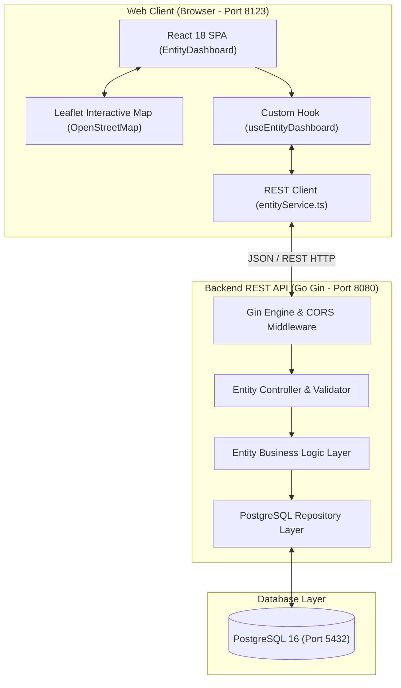

# FE Entity Info — Geospatial Entity Management Frontend

[](https://react.dev/)
[](https://www.typescriptlang.org/)
[](https://rspack.rs/)
[](https://leafletjs.com/)
[](https://tailwindcss.com/)
[](https://jestjs.io/)
[](https://www.docker.com/)

Aplikasi web frontend modern untuk visualisasi dan pengelolaan entitas geospasial real-time (_Geospatial Entity Management System_). Dibangun dengan **React 18**, **TypeScript**, **Rspack**, **Tailwind CSS**, dan **Leaflet**, aplikasi ini terintegrasi langsung secara end-to-end dengan backend Go Gin REST API (`be-entity-info`) dan database PostgreSQL.

---

## 📚 Daftar Isi

- [FE Entity Info — Geospatial Entity Management Frontend](#fe-entity-info--geospatial-entity-management-frontend)
  - [📚 Daftar Isi](#-daftar-isi)
  - [🌟 Fitur Utama](#-fitur-utama)
  - [🏛️ Arsitektur Sistem](#️-arsitektur-sistem)
  - [🛠️ Tech Stack](#️-tech-stack)
  - [📂 Struktur Direktori](#-struktur-direktori)
  - [⚙️ Variabel Lingkungan (Environment Variables)](#️-variabel-lingkungan-environment-variables)
  - [🚀 Panduan Instalasi & Menjalankan](#-panduan-instalasi--menjalankan)
    - [Prasyarat](#prasyarat)
    - [Opsi 1: Menjalankan di Local (Development Mode)](#opsi-1-menjalankan-di-local-development-mode)
    - [Opsi 2: Menjalankan dengan Docker Compose](#opsi-2-menjalankan-dengan-docker-compose)
  - [📡 Integrasi REST API Backend](#-integrasi-rest-api-backend)
  - [🧪 Pengujian & Kualitas Kode](#-pengujian--kualitas-kode)
  - [🤖 Dokumentasi Agentic AI](#-dokumentasi-agentic-ai)

---

## 🌟 Fitur Utama

### 1. Peta Geospasial Interaktif (Leaflet + OpenStreetMap)

- **Zero API Key & Open-Source**: Menggunakan tile layer OpenStreetMap yang 100% gratis, bebas limit, dan bebas watermark.
- **Dark Mode Tile Filter**: Filter CSS terkurasi (`.map-tiles-dark`) yang menyatu dengan estetika dark theme modern.
- **Custom Status Markers**: Marker dinamis dengan warna berdasarkan status entitas:
  - 🟢 **Active**: Hijau (`#4F9669`)
  - 🟡 **Idle**: Kuning (`#D7C525`)
  - 🔵 **Maintenance**: Biru (`#3575F3`)
  - 🔴 **Offline**: Merah (`#C13B3B`)
- **Pulsating Aura Selection**: Efek animasi glow & pulse cincin saat entitas dipilih di peta atau roster.
- **Smooth Camera Animations**: Fitur _flyTo/panTo_ dengan tingkat zoom seimbang (level `10`) saat memilih entitas.
- **Smart Filter Auto-Fit**: Otomatis menghitung _bounding box_ kamera saat filter tipe/status dipilih agar seluruh titik yang sesuai terlihat bersamaan di layar.
- **Pick Coordinates on Map Click**: Klik di titik mana pun pada peta untuk menempatkan pin interaktif sementara (`+`) dan otomatis mengisi input koordinat latitude/longitude pada formulir.

### 2. Manajemen Entitas Lengkap (Full CRUD)

- **Create**: Formulir penambahan entitas dengan validasi presisi koordinat desimal dan atribut dinamis.
- **Read & Detail**: Panel inspeksi detail entitas menampilkan metadata, koordinat, deskripsi, waktu pembaruan, dan atribut key-value.
- **Update**: Modal edit untuk mengubah data entitas langsung tersinkronisasi ke backend.
- **Delete**: Penghapusan entitas yang aman dengan pembaruan instan pada peta dan metrik.

### 3. Roster, Filter & Pencarian Cerdas

- **Pencarian Real-Time**: Pencarian teks berdasarkan nama entitas.
- **Filter Multi-Kategori**: Filter berdasarkan tipe (`Vehicle`, `IoT Device`, `Facility`, `Asset`) dan status operasi (`Active`, `Idle`, `Maintenance`, `Offline`).
- **Clean Initial State**: Tanpa data dummy tiruan; jika database kosong, aplikasi menampilkan status bersih (_empty state_) yang transparan.

### 4. Metrik Ringkasan (KPI Cards)

- Kartu metrik langsung terhubung dengan endpoint `GET /api/v1/entities/metrics` backend untuk menghitung total entitas, unit aktif, unit offline, dan jumlah fasilitas.

---

## 🏛️ Arsitektur Sistem



---

## 🛠️ Tech Stack

| Komponen                  | Teknologi                    | Keterangan                                 |
| ------------------------- | ---------------------------- | ------------------------------------------ |
| **Core Framework**        | React 18.3.1                 | UI library berbasis komponen fungsional    |
| **Language**              | TypeScript 5.8+              | _Type safety_ dan kontrak interface ketat  |
| **Bundler / Build Tool**  | Rspack 1.3+                  | High-performance Rust-based bundler        |
| **Map Library**           | Leaflet 1.9.4                | Library peta interaktif geospasial         |
| **Map Tile Provider**     | OpenStreetMap                | Open-source tile raster tanpa API key      |
| **Styling**               | Tailwind CSS 3.4+            | Utility-first CSS & dark theme tokens      |
| **HTTP Client**           | Axios 1.8+                   | REST API communication & error handling    |
| **Unit Testing**          | Jest + React Testing Library | 5 test suites (39 unit tests passed)       |
| **Production Web Server** | Nginx 1.25 Alpine            | Docker container dengan SPA routing & gzip |

---

## 📂 Struktur Direktori

```
fe-entity-info/
├── config/
│   └── nginx.conf              # Konfigurasi Nginx untuk Docker container
├── src/
│   ├── common/                 # Reusable UI primitives (Button, Card, PopUp, Input, etc.)
│   ├── components/
│   │   ├── EntityDashboard.tsx # Layout utama dashboard & metrik
│   │   └── entity-management/  # Fitur: EntityMap, EntityList, EntityDetails, EntityFormModal
│   ├── constants/              # Pilihan dropdown, kategori, status opsi
│   ├── domain/
│   │   └── geospatial-entity.ts# Kontrak tipe DTO, enum, dan schema domain
│   ├── hooks/
│   │   ├── useEntityDashboard.ts      # Custom hook state & sinkronisasi API
│   │   └── useEntityDashboard.test.ts # Unit test state hook
│   ├── services/
│   │   ├── entityService.ts    # Axios REST API client
│   │   └── entityService.test.ts# Unit test API client
│   ├── utils/
│   │   └── entity-management.ts# Helper format koordinat, waktu, dan validasi
│   ├── App.tsx                 # Root application component
│   ├── main.tsx                # Entrypoint rendering React DOM
│   └── index.css               # Styling Tailwind & filter dark Leaflet
├── Dockerfile                  # Multi-stage production container
├── docker-compose.yaml         # Compose runner untuk service frontend
├── rspack.config.ts            # Konfigurasi Rspack bundler & module federation
├── package.json                # Dependensi & skrip npm
├── AGENT.md                    # Dokumentasi arsitektur Agentic AI
└── README.md                   # Dokumentasi utama proyek
```

---

## ⚙️ Variabel Lingkungan (Environment Variables)

Salin template file `.env.example` ke `.env`:

```bash
cp .env.example .env
```

| Variabel              | Default                        | Deskripsi                                     |
| --------------------- | ------------------------------ | --------------------------------------------- |
| `SERVICE_NAME`        | `FE_ENTITY_INFO`               | Nama identitas service Module Federation      |
| `SERVICE_NAME_DOCKER` | `fe-entity-info`               | Nama image dan container Docker               |
| `BUILD_TAG`           | `latest`                       | Tag image Docker                              |
| `PORT`                | `8123`                         | Port listening web server (local & container) |
| `VITE_API_BASE_URL`   | `http://localhost:8080/api/v1` | URL base REST API backend Go Gin              |

---

## 🚀 Panduan Instalasi & Menjalankan

### Prasyarat

- **Node.js**: `v20.x` atau lebih baru
- **Package Manager**: `pnpm` (`v9.x` atau `v10.x`)
- **Docker & Docker Compose**: (Opsional untuk containerized mode)

---

### Opsi 1: Menjalankan di Local (Development Mode)

1. **Install dependensi**:

   ```bash
   pnpm install
   ```

2. **Jalankan local development server**:

   ```bash
   pnpm run dev
   ```

3. Buka browser pada alamat:
   👉 **`http://localhost:8123`**

---

### Opsi 2: Menjalankan dengan Docker Compose

1. **Build dan jalankan container di background**:

   ```bash
   docker compose up --build -d
   ```

2. **Periksa status container**:

   ```bash
   docker compose ps
   ```

3. Buka browser pada alamat:
   👉 **`http://localhost:8123`**

4. **Menghentikan container**:
   ```bash
   docker compose down
   ```

---

## 📡 Integrasi REST API Backend

Frontend berkomunikasi dengan endpoint backend Go Gin berikut:

| Method   | Endpoint                   | Deskripsi                                                              | Penggunaan Komponen Frontend   |
| -------- | -------------------------- | ---------------------------------------------------------------------- | ------------------------------ |
| `GET`    | `/api/v1/entities`         | Mengambil daftar entitas (mendukung filter `kind`, `status`, `search`) | Peta Geospasial & Tabel Roster |
| `GET`    | `/api/v1/entities/:id`     | Mengambil detail 1 entitas berdasarkan ID                              | Panel Detail Entitas           |
| `POST`   | `/api/v1/entities`         | Membuat entitas geospasial baru                                        | Modal Form Add Entity          |
| `PUT`    | `/api/v1/entities/:id`     | Memperbarui data entitas yang ada                                      | Modal Form Edit Entity         |
| `DELETE` | `/api/v1/entities/:id`     | Menghapus entitas permanen                                             | Aksi Delete pada Detail Panel  |
| `GET`    | `/api/v1/entities/metrics` | Mengambil ringkasan statistik metrik agregat                           | Kartu Metrik KPI Dashboard     |

---

## 🧪 Pengujian & Kualitas Kode

Aplikasi dilengkapi pengujian unit komprehensif menggunakan **Jest** dan **React Testing Library**:

```bash
# 1. Menjalankan seluruh test suite unit test
pnpm test

# 2. Menjalankan linter (ESLint) dan formatter (Prettier)
pnpm run format-lint

# 3. Memperbaiki linting otomatis
pnpm run lint:fix

# 4. Melakukan kompilasi bundle produksi
pnpm run build
```

**Hasil Pengujian:**

```text
PASS src/components/entity-management/EntityList.test.tsx
PASS src/components/entity-management/EntityFormModal.test.tsx
PASS src/components/EntityDashboard.test.tsx
PASS src/services/entityService.test.ts
PASS src/hooks/useEntityDashboard.test.ts

Test Suites: 5 passed, 5 total
Tests:       39 passed, 39 total
Snapshots:   0 total
Time:        1.33 s
```

---

## 🤖 Dokumentasi Agentic AI

Proyek ini dikembangkan dengan menerapkan alur kerja **Agentic AI Pair-Programming**. Dokumentasi keputusan arsitektur teknis (_ADR_), panduan AI collaborator, dan audit prompt selengkapnya dapat dibaca pada file:
👉 **[AGENT.md](file:///AGENT.md)**

---

## 📄 Lisensi & Pemeliharaan

Dikembangkan untuk **Take-Home Test - Geospatial Entity Management System**.
Dikelola oleh **Muhammad Rifky Janzani**.
