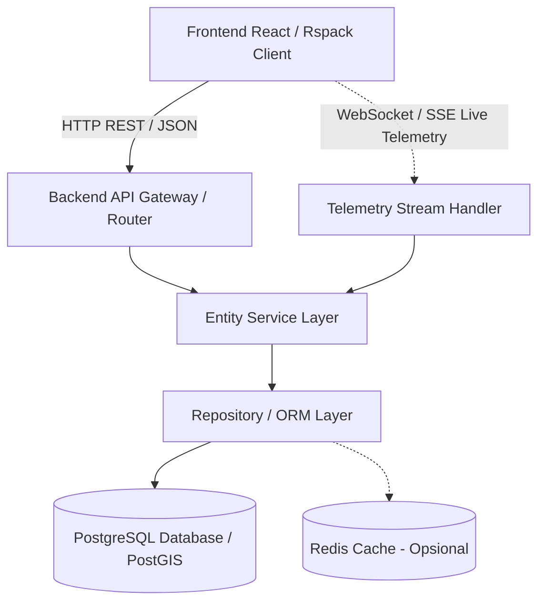
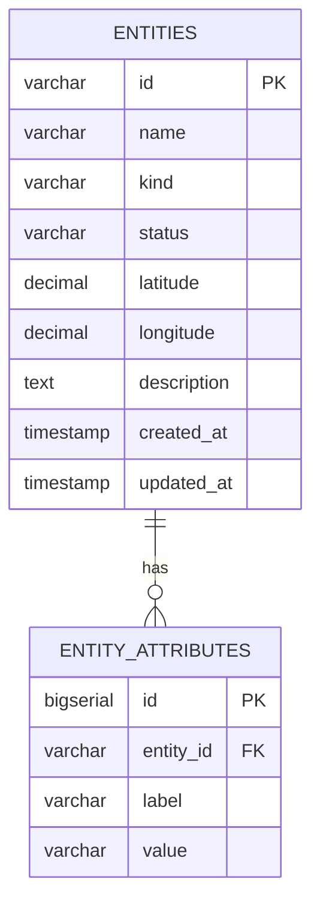

# Product Requirement Document (PRD)

## Backend Service – Geospatial Entity Management System

---

## 1. Ringkasan Dokumen & Latar Belakang

- **Nama Dokumen**: Product Requirement Document (PRD) – Backend Service Geospatial Entity Management
- **Versi**: 1.0.0
- **Status**: Draft / Ready for Implementation
- **Target Frontend**: `fe-video-support` (`fe-entity-info`)

### 1.1 Latar Belakang

Saat ini, aplikasi frontend _Geospatial Entity Management_ telah selesai diimplementasikan dengan antarmuka peta interaktif, roster/list entitas, panel detail, indikator metrik, serta modal PopUp untuk penambahan dan pengubahan data. Namun, seluruh data entitas saat ini masih disimpan di _in-memory local state_ React (bersifat sementara dan hilang saat halaman di-refresh).

Dokumen ini mendefinisikan kebutuhan fungsional dan non-fungsional untuk membangun layanan **Backend Service** mandiri yang bertugas mengelola persistensi data, validasi bisnis, agregasi metrik, serta menyediakan antarmuka API (REST & Real-time Telemetry) yang akan dikonsumsi oleh frontend.

---

## 2. Tujuan & Sasaran Sistem (Goals & Objectives)

1. **Persistensi Data yang Handal**: Menyimpan data entitas geospatial dan atribut dinamisnya ke dalam database relasional secara permanen.
2. **Manajemen CRUD Lengkap**: Menyediakan endpoint API untuk Create, Read (List & Detail), Update, dan Delete entitas secara aman dan tervalidasi.
3. **Agregasi Metrik & Status**: Menghitung metrik ringkasan (Total Entity, Active, Offline, Facilities) secara efisien di level backend.
4. **Dukungan Kueri Spasial (Geospatial Support)**: Mendukung validasi dan pencarian koordinat geografis (_latitude_ & _longitude_).
5. **Kesiapan Integrasi Real-Time (Telemetry)**: Mempersiapkan arsitektur backend untuk menerima pembaruan telemetri/koordinat secara live via WebSocket/gRPC.

---

## 3. Arsitektur Sistem & Rekomendasi Tech Stack



### 3.1 Rekomendasi Teknologi

- **Bahasa & Framework**:
  - **Opsi Utama (Go)**: Go dengan framework **Gin** atau **Fiber** (ringan, performa tinggi, concurrency andal).
  - **Alternatif (Node.js/TypeScript)**: **NestJS** atau **Express** dengan TypeScript.
  - **Alternatif (Python)**: **FastAPI** dengan Pydantic & SQLAlchemy.
- **Database**: **PostgreSQL** (disarankan menambahkan ekstensi `PostGIS` untuk kueri spasial).
- **ORM / Database Driver**: GORM / `sqlx` (Go), Prisma / TypeORM (Node.js), atau SQLAlchemy (Python).
- **Containerization**: Docker & Docker Compose untuk orkestrasi backend dan database lokal.

---

## 4. Skema Data & Model (Database Schema)



### 4.1 Tabel `entities`

| Nama Kolom    | Tipe Data                  | Constraint      | Deskripsi                                                  |
| :------------ | :------------------------- | :-------------- | :--------------------------------------------------------- |
| `id`          | `VARCHAR(32)`              | `PRIMARY KEY`   | Format ID entitas, contoh: `ENT-001` atau `ENT-XXXXXX`     |
| `name`        | `VARCHAR(255)`             | `NOT NULL`      | Nama entitas / unit                                        |
| `kind`        | `VARCHAR(50)`              | `NOT NULL`      | Enum: `'Vehicle'`, `'IoT Device'`, `'Facility'`, `'Asset'` |
| `status`      | `VARCHAR(50)`              | `NOT NULL`      | Enum: `'Active'`, `'Idle'`, `'Maintenance'`, `'Offline'`   |
| `latitude`    | `DECIMAL(10, 6)`           | `NOT NULL`      | Koordinat Lintang (-90.000000 s/d 90.000000)               |
| `longitude`   | `DECIMAL(10, 6)`           | `NOT NULL`      | Koordinat Bujur (-180.000000 s/d 180.000000)               |
| `description` | `TEXT`                     | `NULLABLE`      | Keterangan / deskripsi peran entitas                       |
| `created_at`  | `TIMESTAMP WITH TIME ZONE` | `DEFAULT NOW()` | Waktu entitas pertama kali dibuat                          |
| `updated_at`  | `TIMESTAMP WITH TIME ZONE` | `DEFAULT NOW()` | Waktu entitas terakhir kali diperbarui                     |

### 4.2 Tabel `entity_attributes`

| Nama Kolom  | Tipe Data            | Constraint                                  | Deskripsi                                                 |
| :---------- | :------------------- | :------------------------------------------ | :-------------------------------------------------------- |
| `id`        | `BIGSERIAL` / `UUID` | `PRIMARY KEY`                               | ID unik atribut                                           |
| `entity_id` | `VARCHAR(32)`        | `REFERENCES entities(id) ON DELETE CASCADE` | Relasi ke entitas induk                                   |
| `label`     | `VARCHAR(100)`       | `NOT NULL`                                  | Kunci/label atribut (contoh: `Owner`, `Speed`, `Battery`) |
| `value`     | `VARCHAR(255)`       | `NOT NULL`                                  | Nilai atribut (contoh: `Logistics Ops`, `42 km/h`)        |

> **Catatan Alternatif**: Pada database PostgreSQL, atribut dapat disimpan langsung di kolom `attributes JSONB` pada tabel `entities` jika ingin struktur yang lebih fleksibel tanpa tabel terpisah.

---

## 5. Spesifikasi Endpoint API (RESTful API)

### 5.1 Format Standar Respon (Envelope Format)

**Respon Sukses:**

```json
{
	"success": true,
	"data": {},
	"message": "Operation successful"
}
```

**Respon Error:**

```json
{
	"success": false,
	"error": {
		"code": "VALIDATION_ERROR",
		"message": "Invalid latitude value",
		"details": {
			"latitude": "Latitude must be between -90 and 90"
		}
	}
}
```

---

### 5.2 Daftar Endpoint

#### 1. `GET /api/v1/entities`

Mengambil daftar entitas yang terdaftar beserta atribut dan statusnya.

- **Query Parameters**:
  - `kind` _(opsional)_: Filter kategori (`Vehicle`, `IoT Device`, `Facility`, `Asset`)
  - `status` _(opsional)_: Filter status (`Active`, `Idle`, `Maintenance`, `Offline`)
  - `search` _(opsional)_: Pencarian nama entitas
- **Response `200 OK`**:

```json
{
	"success": true,
	"data": [
		{
			"id": "ENT-001",
			"name": "Harbor Shuttle 12",
			"kind": "Vehicle",
			"status": "Active",
			"latitude": -6.1754,
			"longitude": 106.8272,
			"description": "Shuttle unit that moves cargo between zones.",
			"attributes": [
				{ "label": "Owner", "value": "Logistics Ops" },
				{ "label": "Speed", "value": "42 km/h" },
				{ "label": "Signal", "value": "Stable" }
			],
			"updatedAt": "Updated 5 min ago"
		}
	]
}
```

---

#### 2. `GET /api/v1/entities/:id`

Mengambil detail satu entitas berdasarkan ID.

- **Response `200 OK`**: Detail objek entitas tunggal.
- **Response `404 Not Found`**: Jika entitas tidak ditemukan.

---

#### 3. `POST /api/v1/entities`

Membuat entitas baru.

- **Request Body**:

```json
{
	"name": "Delivery Drone 05",
	"kind": "Vehicle",
	"status": "Active",
	"latitude": -6.2088,
	"longitude": 106.8456,
	"description": "Autonomous delivery drone for medical supply route.",
	"attributes": [
		{ "label": "Battery", "value": "95%" },
		{ "label": "Payload", "value": "2.5 kg" }
	]
}
```

- **Response `201 Created`**:

```json
{
	"success": true,
	"data": {
		"id": "ENT-7A8B9C",
		"name": "Delivery Drone 05",
		"kind": "Vehicle",
		"status": "Active",
		"latitude": -6.2088,
		"longitude": 106.8456,
		"description": "Autonomous delivery drone for medical supply route.",
		"attributes": [
			{ "label": "Battery", "value": "95%" },
			{ "label": "Payload", "value": "2.5 kg" }
		],
		"updatedAt": "Created just now"
	},
	"message": "Entity created successfully"
}
```

---

#### 4. `PUT /api/v1/entities/:id`

Memperbarui data entitas yang ada.

- **Request Body**:

```json
{
	"name": "Delivery Drone 05 - Revised",
	"kind": "Vehicle",
	"status": "Idle",
	"latitude": -6.21,
	"longitude": 106.847,
	"description": "Re-routed for battery maintenance.",
	"attributes": [
		{ "label": "Battery", "value": "40%" },
		{ "label": "Payload", "value": "0 kg" }
	]
}
```

- **Response `200 OK`**: Objek entitas yang telah diperbarui.
- **Response `404 Not Found`**: Jika ID entitas tidak ditemukan.

---

#### 5. `DELETE /api/v1/entities/:id`

Menghapus entitas berdasarkan ID.

- **Response `200 OK`**:

```json
{
	"success": true,
	"message": "Entity ENT-7A8B9C deleted successfully"
}
```

---

#### 6. `GET /api/v1/entities/metrics`

Mengambil metrik agregat statistik untuk kartu dashboard.

- **Response `200 OK`**:

```json
{
	"success": true,
	"data": {
		"totalCount": 12,
		"activeCount": 8,
		"offlineCount": 2,
		"facilityCount": 3
	}
}
```

---

#### 7. `POST /api/v1/entities/reset` _(Demo / Development Only)_

Mereset data di database ke data demo awal (_initialEntities seed_).

- **Response `200 OK`**: Mengembalikan daftar entitas default.

---

## 6. Aturan Bisnis & Validasi (Business Logic)

1. **Validasi Nama**:
   - Wajib diisi (_non-empty string_), panjang 1 s/d 255 karakter.
2. **Validasi Kategori (_Kind_)**:
   - Hanya menerima nilai: `'Vehicle'`, `'IoT Device'`, `'Facility'`, `'Asset'`.
3. **Validasi Status**:
   - Hanya menerima nilai: `'Active'`, `'Idle'`, `'Maintenance'`, `'Offline'`.
4. **Validasi Koordinat Geospasial**:
   - **Latitude**: Harus angka desimal antara `-90.0000` hingga `90.0000`.
   - **Longitude**: Harus angka desimal antara `-180.0000` hingga `180.0000`.
5. **Validasi Atribut**:
   - Array objek `{ label: string, value: string }`.
   - `label` tidak boleh string kosong setelah di-_trim_.

---

## 7. Keamanan, CORS & Environment Variables

### 7.1 Kebijakan CORS (Cross-Origin Resource Sharing)

Backend wajib mengizinkan origin frontend:

- `http://localhost:3000` / `http://localhost:8080` (Development)
- Origin produksi yang ditentukan melalui environment variable.
- Mengizinkan Header: `Content-Type`, `Authorization`, `Accept`.
- Mengizinkan Method: `GET`, `POST`, `PUT`, `DELETE`, `OPTIONS`.

### 7.2 Spesifikasi Environment Variables (`.env`) Backend

```env
# Server
PORT=8080
APP_ENV=development
ALLOWED_ORIGINS=http://localhost:3000,http://localhost:8080

# Database
DB_HOST=localhost
DB_PORT=5432
DB_USER=postgres
DB_PASSWORD=postgres
DB_NAME=entity_management_db
DB_SSLMODE=disable

# Telemetry (Optional)
TELEMETRY_WS_ENABLED=true
```

---

## 8. Panduan Integrasi ke Frontend (`fe-video-support`)

Saat backend telah selesai dibuat, integrasi pada frontend dilakukan dengan langkah-langkah berikut:

1. **Tambahkan URL Backend ke `.env` Frontend**:
   ```env
   VITE_API_BASE_URL=http://localhost:8080/api/v1
   ```
2. **Buat Service API Layer** (contoh: `src/services/entityService.ts`):
   - `fetchEntities()`
   - `createEntity(payload)`
   - `updateEntity(id, payload)`
   - `deleteEntity(id)`
   - `resetEntities()`
3. **Perbarui Hook [useEntityDashboard.ts](file:///home/rifky_rjanzani/fe-video-support/src/hooks/useEntityDashboard.ts)**:
   - Tambahkan state `isLoading` dan `error`.
   - Ganti initial state statis dengan pemanggilan `fetchEntities()` pada `useEffect`.
   - Modifikasi `handleSubmit`, `handleDelete`, dan `handleReset` agar memanggil service API sebelum memperbarui local state.

---

## 9. Rencana Tahapan Pengerjaan (Milestones)

| Fase                                       | Target Deliverable                                                                                                   | Estimasi   |
| :----------------------------------------- | :------------------------------------------------------------------------------------------------------------------- | :--------- |
| **Fase 1: Setup & Database**               | Inisialisasi repository backend, skema migrasi database PostgreSQL, koneksi DB, dan container Docker Compose         | 1 - 2 Hari |
| **Fase 2: Core REST CRUD**                 | Implementasi model, repository, service, dan handler controller untuk seluruh endpoint CRUD entitas & validasi input | 2 - 3 Hari |
| **Fase 3: Unit Testing & Seed Data**       | Pembuatan unit test untuk handler & service, serta endpoint seeder `/api/v1/entities/reset`                          | 1 Hari     |
| **Fase 4: Integrasi Frontend**             | Menghubungkan frontend `fe-video-support` dengan backend, pengujian end-to-end, dan penanganan error state           | 1 - 2 Hari |
| **Fase 5: Real-time Telemetry (Opsional)** | Implementasi WebSocket / gRPC stream untuk pembaruan posisi entitas secara live pada peta                            | 2 Hari     |
