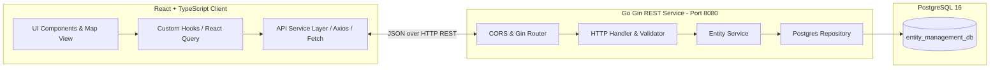

# Product Requirement Document (PRD)

## Frontend Integration – Geospatial Entity Management System

---

## 1. Ringkasan Dokumen & Latar Belakang

- **Nama Dokumen**: Product Requirement Document (PRD) – Frontend Integration Guide
- **Versi**: 1.0.0
- **Status**: Ready for Integration
- **Target Aplikasi**: Frontend React + TypeScript (`fe-entity-info` / `fe-video-support`)
- **Backend Service**: Go (Gin) REST API (`http://localhost:8080/api/v1`)
- **Database**: PostgreSQL 16 (Docker)

### 1.1 Latar Belakang

Backend service telah selesai dibangun menggunakan Go (Gin) dengan arsitektur _Clean Architecture / Separation of Concerns_. Backend menyediakan persistensi data permanen di PostgreSQL, validasi ketat, agregasi metrik, dan dukungan CORS.

Dokumen PRD ini ditujukan sebagai panduan teknis dan fungsional bagi tim frontend untuk mengintegrasikan antarmuka pengguna (React + TypeScript) dengan REST API backend.

---

## 2. Tujuan Integrasi (Integration Goals)

1. **Konektivitas End-to-End**: Mengganti _in-memory / mock state_ frontend dengan integrasi langsung ke REST API backend.
2. **Sinkronisasi Data Real-Time & Konsisten**: Memastikan operasi CRUD pada peta, tabel, dan formulir langsung tersinkronisasi dengan database.
3. **Validasi & Error Handling yang Ramah Pengguna**: Menampilkan feedback visual (inline validation error per field, toast notifikasi) dari respons backend.
4. **Performa & UX Optimal**: Mengimplementasikan _caching_, _optimistic updates_, dan _loading state / skeleton_ saat fetching data.

---

## 3. Arsitektur Komunikasi & Kontrak API



### 3.1 Base URL & Environment Variable

Tambahkan variabel environment pada root project frontend:

```env
# .env atau .env.local
VITE_API_BASE_URL=http://localhost:8080/api/v1
# Jika menggunakan Create-React-App:
# REACT_APP_API_BASE_URL=http://localhost:8080/api/v1
```

---

## 4. Standar Tipe Data (TypeScript Contracts)

### 4.1 Model Entitas & Enums

```typescript
// types/entity.ts

export type EntityKind = "Vehicle" | "IoT Device" | "Facility" | "Asset";

export type EntityStatus = "Active" | "Idle" | "Maintenance" | "Offline";

export interface EntityAttribute {
	label: string;
	value: string;
}

export interface Entity {
	id: string; // Format: "ENT-XXXXXX"
	name: string;
	kind: EntityKind;
	status: EntityStatus;
	latitude: number; // Range: -90.0 s/d 90.0
	longitude: number; // Range: -180.0 s/d 180.0
	description?: string;
	attributes?: EntityAttribute[];
	createdAt: string; // ISO 8601 string
	updatedAt: string; // ISO 8601 string
}

export interface EntityMetrics {
	totalCount: number;
	activeCount: number;
	idleCount: number;
	maintenanceCount: number;
	offlineCount: number;
	vehicleCount: number;
	iotDeviceCount: number;
	facilityCount: number;
	assetCount: number;
}
```

### 4.2 Request DTOs

```typescript
// types/api.ts

export interface CreateEntityPayload {
	name: string;
	kind: EntityKind;
	status: EntityStatus;
	latitude: number;
	longitude: number;
	description?: string;
	attributes?: EntityAttribute[];
}

export interface UpdateEntityPayload {
	name?: string;
	kind?: EntityKind;
	status?: EntityStatus;
	latitude?: number;
	longitude?: number;
	description?: string;
	attributes?: EntityAttribute[];
}

export interface EntityQueryParams {
	kind?: EntityKind;
	status?: EntityStatus;
	search?: string;
	limit?: number;
	offset?: number;
}
```

### 4.3 Response Envelope Format

```typescript
// types/response.ts

export interface ValidationErrorDetail {
	field: string;
	message: string;
}

export interface ApiSuccessResponse<T> {
	success: true;
	message?: string;
	data: T;
}

export interface ApiErrorResponse {
	success: false;
	error: {
		code: string; // "VALIDATION_ERROR", "NOT_FOUND", "INTERNAL_ERROR"
		message: string;
		details?: ValidationErrorDetail[];
	};
}

export type ApiResponse<T> = ApiSuccessResponse<T> | ApiErrorResponse;
```

---

## 5. Pemetaan Endpoint API & Integrasi Komponen

| No  | Endpoint        | Method   | Deskripsi                                         | Komponen Frontend Terkait                           |
| :-- | :-------------- | :------- | :------------------------------------------------ | :-------------------------------------------------- |
| 1   | `/entities`     | `GET`    | Mengambil daftar entitas (dengan filter & search) | **Map View**, **Entity Table/List**, **Filter Bar** |
| 2   | `/entities/:id` | `GET`    | Mengambil detail 1 entitas                        | **Entity Detail Drawer/Modal**, **Popup Marker**    |
| 3   | `/entities`     | `POST`   | Menambahkan entitas baru                          | **Add Entity Modal / Form**, **Pin-to-Map Form**    |
| 4   | `/entities/:id` | `PUT`    | Memperbarui entitas yang ada                      | **Edit Entity Modal / Form**                        |
| 5   | `/entities/:id` | `DELETE` | Menghapus entitas                                 | **Delete Confirmation Dialog**                      |
| 6   | `/metrics`      | `GET`    | Mengambil ringkasan statistik entitas             | **Dashboard Metric Cards / KPI Bar**                |
| 7   | `/health`       | `GET`    | Healthcheck status server & DB                    | **Server Status Indicator**                         |

---

## 6. Detail Kebutuhan Fungsional Frontend

### 6.1 Peta Geospasial (Interactive Map View)

- **Visualisasi Marker**:
  - Render marker untuk setiap entitas berdasarkan koordinat `latitude` dan `longitude`.
  - Berikan ikon atau warna marker berbeda berdasarkan `kind` atau `status` (contoh: _Green_ = Active, _Yellow_ = Idle, _Orange_ = Maintenance, _Red/Gray_ = Offline).
- **Interaksi Klik Marker**:
  - Klik marker membuka Popup ringkas atau memicu pemilihan entitas aktif ke panel detail.
- **Interaksi Klik Peta (Pick Coordinates)**:
  - Saat mode "Tambah Entitas" aktif, klik pada peta dapat otomatis mengisi input `latitude` dan `longitude` di form penambahan.

### 6.2 Filter, Pencarian & Roster Entitas (Entity List)

- **Fitur Filter**:
  - Filter berdasarkan `kind` (`Vehicle`, `IoT Device`, `Facility`, `Asset`).
  - Filter berdasarkan `status` (`Active`, `Idle`, `Maintenance`, `Offline`).
- **Debounced Search**:
  - Implementasikan debounce (misal 300ms–500ms) pada input pencarian teks sebelum memicu request `GET /entities?search=...`.
- **Sinkronisasi Seleksi**:
  - Mengklik item pada tabel/list memusatkan (_flyTo/panTo_) kamera peta ke koordinat entitas tersebut.

### 6.3 Formulir Tambah & Edit Entitas

- **Input Fields**:
  - **Nama**: Text input (Wajib).
  - **Kategori (Kind)**: Dropdown select (`Vehicle`, `IoT Device`, `Facility`, `Asset`).
  - **Status**: Dropdown select (`Active`, `Idle`, `Maintenance`, `Offline`).
  - **Latitude**: Number input (-90.0 s/d 90.0).
  - **Longitude**: Number input (-180.0 s/d 180.0).
  - **Deskripsi**: Textarea (Opsional).
  - **Atribut Dinamis**: Dynamic key-value inputs (`label` & `value`).
- **Penanganan Validasi Error (HTTP 400)**:
  - Tangkap array `error.details` dari backend.
  - Tampilkan pesan error tepat di bawah masing-masing input field yang tidak valid.

### 6.4 Panel Metrik & Dashboard

- Memanggil `GET /metrics` saat inisialisasi aplikasi.
- Menampilkan kartu ringkasan:
  - **Total Entitas** (`totalCount`)
  - **Entitas Aktif** (`activeCount`)
  - **Entitas Idle / Maintenance** (`idleCount`, `maintenanceCount`)
  - **Entitas Offline** (`offlineCount`)
  - **Jumlah per Kategori** (Vehicle, IoT Device, Facility, Asset)

---

## 7. Rekomendasi Pola Implementasi (Code Blueprint)

### 7.1 API Client Service (`src/services/entityService.ts`)

```typescript
import axios, { AxiosResponse } from "axios";

import {
	ApiSuccessResponse,
	CreateEntityPayload,
	Entity,
	EntityMetrics,
	EntityQueryParams,
	UpdateEntityPayload
} from "../types";

const API_BASE_URL =
	import.meta.env.VITE_API_BASE_URL || "http://localhost:8080/api/v1";

const apiClient = axios.create({
	baseURL: API_BASE_URL,
	headers: {
		"Content-Type": "application/json"
	}
});

export const entityService = {
	// 1. Ambil daftar entitas
	getEntities: async (params?: EntityQueryParams): Promise<Entity[]> => {
		const response = await apiClient.get<ApiSuccessResponse<Entity[]>>(
			"/entities",
			{ params }
		);
		return response.data.data;
	},

	// 2. Ambil detail entitas
	getEntityById: async (id: string): Promise<Entity> => {
		const response = await apiClient.get<ApiSuccessResponse<Entity>>(
			`/entities/${id}`
		);
		return response.data.data;
	},

	// 3. Tambah entitas baru
	createEntity: async (payload: CreateEntityPayload): Promise<Entity> => {
		const response = await apiClient.post<ApiSuccessResponse<Entity>>(
			"/entities",
			payload
		);
		return response.data.data;
	},

	// 4. Update entitas
	updateEntity: async (
		id: string,
		payload: UpdateEntityPayload
	): Promise<Entity> => {
		const response = await apiClient.put<ApiSuccessResponse<Entity>>(
			`/entities/${id}`,
			payload
		);
		return response.data.data;
	},

	// 5. Hapus entitas
	deleteEntity: async (id: string): Promise<void> => {
		await apiClient.delete(`/entities/${id}`);
	},

	// 6. Ambil ringkasan metrik
	getMetrics: async (): Promise<EntityMetrics> => {
		const response =
			await apiClient.get<ApiSuccessResponse<EntityMetrics>>("/metrics");
		return response.data.data;
	}
};
```

### 7.2 Custom Hook dengan React Query / TanStack Query

```typescript
// src/hooks/useEntities.ts
import { useMutation, useQuery, useQueryClient } from "@tanstack/react-query";

import { entityService } from "../services/entityService";
import {
	CreateEntityPayload,
	EntityQueryParams,
	UpdateEntityPayload
} from "../types";

export const useEntities = (params?: EntityQueryParams) => {
	return useQuery({
		queryKey: ["entities", params],
		queryFn: () => entityService.getEntities(params)
	});
};

export const useEntityMetrics = () => {
	return useQuery({
		queryKey: ["entity-metrics"],
		queryFn: () => entityService.getMetrics()
	});
};

export const useEntityMutations = () => {
	const queryClient = useQueryClient();

	const createMutation = useMutation({
		mutationFn: (payload: CreateEntityPayload) =>
			entityService.createEntity(payload),
		onSuccess: () => {
			queryClient.invalidateQueries({ queryKey: ["entities"] });
			queryClient.invalidateQueries({ queryKey: ["entity-metrics"] });
		}
	});

	const updateMutation = useMutation({
		mutationFn: ({
			id,
			payload
		}: {
			id: string;
			payload: UpdateEntityPayload;
		}) => entityService.updateEntity(id, payload),
		onSuccess: () => {
			queryClient.invalidateQueries({ queryKey: ["entities"] });
			queryClient.invalidateQueries({ queryKey: ["entity-metrics"] });
		}
	});

	const deleteMutation = useMutation({
		mutationFn: (id: string) => entityService.deleteEntity(id),
		onSuccess: () => {
			queryClient.invalidateQueries({ queryKey: ["entities"] });
			queryClient.invalidateQueries({ queryKey: ["entity-metrics"] });
		}
	});

	return { createMutation, updateMutation, deleteMutation };
};
```

---

## 8. Skenario Pengujian Integrasi (Integration Test Cases)

| No        | Skenario Pengujian                       | Aksi                                               | Ekspektasi Hasil                                                                         |
| :-------- | :--------------------------------------- | :------------------------------------------------- | :--------------------------------------------------------------------------------------- |
| **TC-01** | Initial Data Load                        | Buka aplikasi pertama kali                         | Peta dan tabel menampilkan data entitas dari DB; Kartu metrik terisi angka statistik     |
| **TC-02** | Filter & Search                          | Pilih filter `kind=Vehicle` & ketik kata kunci     | Tabel dan pin peta ter-filter hanya menampilkan kendaraan yang cocok                     |
| **TC-03** | Create Valid Entity                      | Isi form entitas dengan data valid & klik Submit   | Entitas baru tersimpan, pin muncul di peta, kartu total count bertambah                  |
| **TC-04** | Create Invalid Entity (Validation Error) | Submit form dengan nama kosong & latitude 999      | Muncul error 400 dari backend, form menampilkan error inline pada field nama & koordinat |
| **TC-05** | Update Entity                            | Ubah status entitas dari `Active` ke `Maintenance` | Warna pin marker di peta langsung berubah, data di tabel terupdate                       |
| **TC-06** | Delete Entity                            | Klik hapus entitas pada dialog konfirmasi          | Entitas terhapus dari peta dan tabel, kartu metrik terupdate otomatis                    |
| **TC-07** | Network / Server Offline                 | Matikan backend saat fetch                         | Tampilkan error banner / toast ramah pengguna bahwa koneksi ke server gagal              |

---

## 9. Checklist Integrasi Tim Frontend

- [ ] Tambahkan konfigurasi `VITE_API_BASE_URL` di `.env` frontend.
- [ ] Buat file tipe data TypeScript (`types/entity.ts`, `types/api.ts`).
- [ ] Buat modul API Service (`services/entityService.ts`).
- [ ] Hubungkan komponen peta (`MapView`) dengan query `getEntities`.
- [ ] Hubungkan filter bar dan search bar dengan parameter query `getEntities`.
- [ ] Hubungkan formulir Tambah & Edit dengan mutasi API dan tangani error inline.
- [ ] Hubungkan dialog Hapus dengan mutasi `deleteEntity`.
- [ ] Hubungkan kartu metrik dashboard dengan `getMetrics`.
- [ ] Lakukan uji coba end-to-end (CRUD, filter, validation error).
